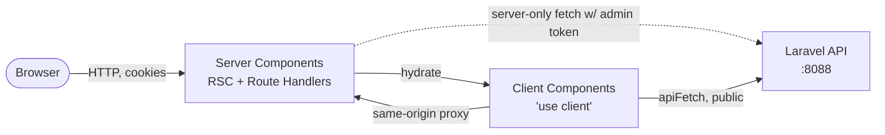
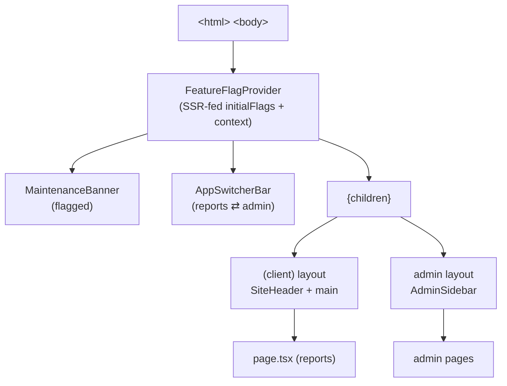
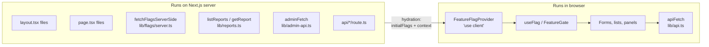
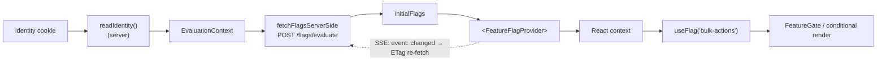
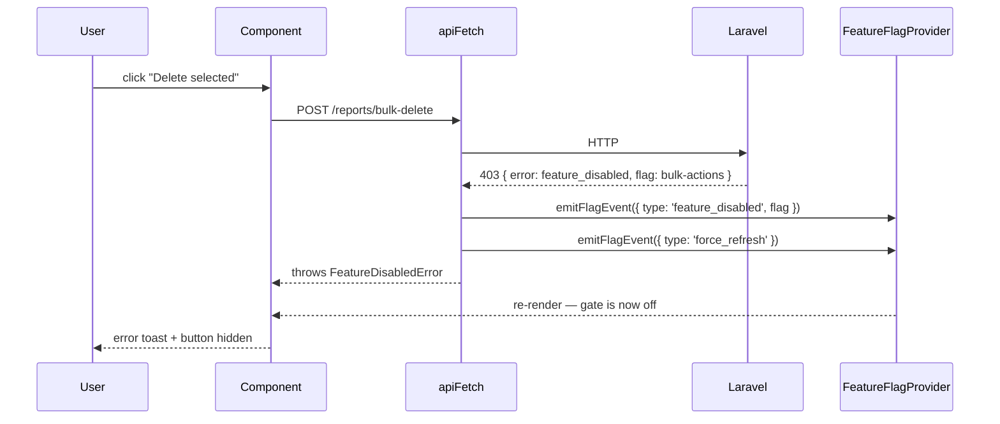
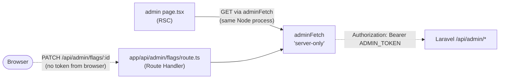
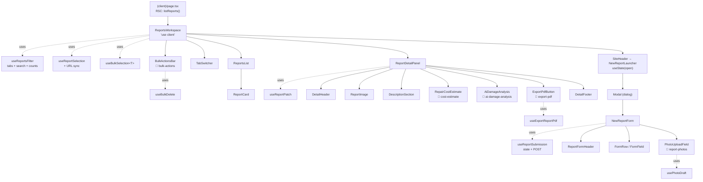
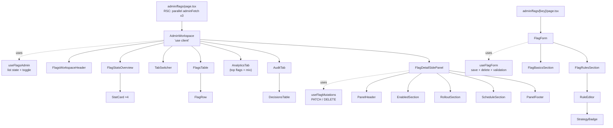
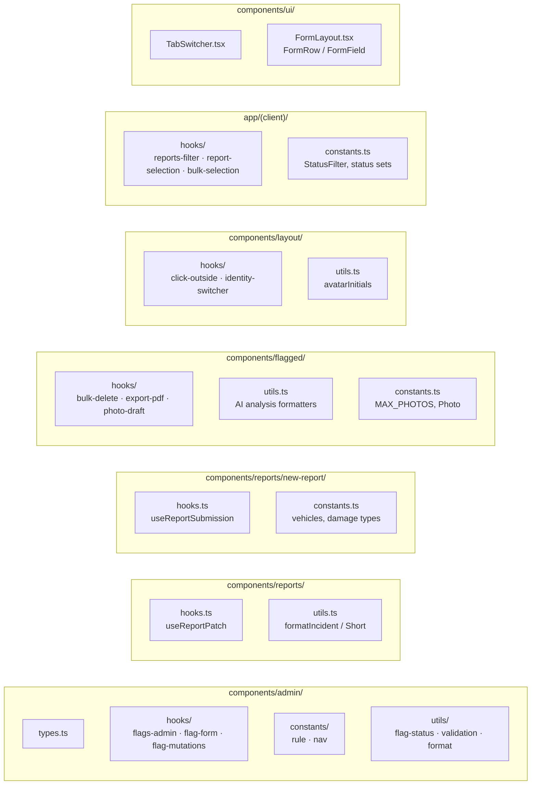

# Frontend at a glance

The Next.js 14 client (App Router, TypeScript, Tailwind). Pair with [`DIAGRAMS.md`](DIAGRAMS.md) for the backend side.

---

## 1. The client at a glance



- **Server side**: layouts, pages, route handlers — runs on Next.js server, holds the admin token, reads cookies.
- **Client side**: anything with `"use client"` — provider, hooks, forms, optimistic UI.
- Two networking helpers, intentional split: [`api.ts`](client/src/lib/api.ts) (browser → Laravel) and [`admin-api.ts`](client/src/lib/admin-api.ts) (Next.js server → Laravel, `server-only`).

---

## 2. App Router structure

```mermaid
flowchart TD
  Root["app/layout.tsx<br/>FeatureFlagProvider + banner + switcher"]

  Root --> Client["(client)/layout.tsx<br/>SiteHeader"]
  Root --> Admin["admin/layout.tsx<br/>AdminSidebar"]
  Root --> Routes["api/*<br/>Next.js Route Handlers"]

  Client --> Home["(client)/page.tsx<br/>ReportsWorkspace (master-detail)"]

  Admin --> Flags["admin/flags/page.tsx<br/>AdminWorkspace"]
  Admin --> FlagEdit["admin/flags/&#91;key&#93;/page.tsx"]
  Admin --> FlagNew["admin/flags/new/page.tsx"]
  Admin --> Other["schedules / decisions / etc."]

  Routes --> AdminProxy["api/admin/flags/*<br/>proxies admin mutations"]
  Routes --> IdentityRoute["api/identity<br/>cookie writer"]
```



- `(client)` is a **route group** — no URL segment, just lets the customer app share a layout.
- **"New report" is a dialog, not a route.** Triggered by [`NewReportLauncher`](client/src/components/layout/NewReportLauncher.tsx) in `SiteHeader`; the form lives in [`components/reports/new-report/`](client/src/components/reports/new-report).
- `app/api/*` are **Next.js Route Handlers**, not Laravel — they exist so the browser never sees the admin token.

---

## 3. Layout nesting



The provider sits **above** the route-group layouts, so a single flag set covers both the customer app and the admin UI for the active identity.

---

## 4. Server vs Client components



Rule of thumb in this repo:

- A page is RSC unless it needs hooks/state → then the page stays RSC and renders a `"use client"` child (e.g. `page.tsx` → `<ReportsWorkspace />`).
- Networking that uses the admin token is **`server-only`** — importing `admin-api.ts` from a client component would throw at build time.

---

## 5. How a flag reaches a component



- First paint: SSR fetches the flag set on the server, hands it to the provider as `initialFlags`, so gates are correct on the very first byte.
- Live updates: the provider opens an `EventSource` to `/api/v1/flags/stream`. The server publishes to a Redis channel on every admin write and forwards `event: changed`; the provider reacts by re-fetching `/flags/evaluate` (`If-None-Match` → 304 when this user's evaluation hasn't changed). No interval polling.

---

## 6. Hot path — first paint sequence

```mermaid
sequenceDiagram
  participant B as Browser
  participant N as Next.js server
  participant API as Laravel

  B->>N: GET / (cookie: identity)
  N->>N: readIdentity() → context
  N->>API: POST /flags/evaluate { user_key, attributes }
  API-->>N: { flags, ETag, Cache-Control: 15s }
  N->>N: render layout + page + provider with initialFlags
  N-->>B: HTML (gates already in correct state)
  B->>B: hydrate
  B->>API: open EventSource GET /flags/stream
  Note over B,API: connection held open; admin writes push `event: changed`
  API-->>B: event: changed (after admin toggles a flag)
  B->>API: POST /flags/evaluate (If-None-Match)
  API-->>B: 304 Not Modified (or fresh body if this user's eval changed)
```

Key consequences:

- **No flicker** — gates are right before hydration runs.
- **No DB hit per page** — Laravel reads from Redis; Next.js / browser can cache the response for 15 s via the `Cache-Control` header.

---

## 7. Flag flips off while a user is on the page



Three layers of defence:

1. **UI gate** ([`useFlag`](client/src/lib/flags/hooks.ts), [`FeatureGate`](client/src/lib/flags/FeatureGate.tsx)) — disappears within one network RTT of the admin write via the SSE `changed` push.
2. **Server enforcement** — Laravel re-evaluates every write, returns 403 if off.
3. **Optimistic local rollback** — [`apiFetch`](client/src/lib/api.ts) flips the gate **now** via the module-level flag event bus ([`events.ts`](client/src/lib/flags/events.ts)) so the worst case is one wasted click — even if the user races the SSE push.

---

## 8. Admin token: never crosses to the browser



- Initial admin reads happen in the RSC and hit Laravel directly with the token (server → server, never serialised to the client).
- Browser mutations (toggle, save, delete) post to **same-origin** Next.js Route Handlers, which add the token before forwarding.
- `admin-api.ts` is marked [`server-only`](https://nextjs.org/docs/app/building-your-application/rendering/composition-patterns#keeping-server-only-code-out-of-the-client-environment) — importing it from a client file is a build-time error.

---

## 9. Component composition

Each workspace is a thin orchestrator that consumes a feature hook and renders focused sub-components. Constants, validation, and HTTP live in co-located `.ts` files (no JSX).

### Reports workspace



### Admin workspace



The 🚩 marks a `useFlag()` / `<FeatureGate>` gate. Six flagged surfaces in total — see §11.

---

## 10. Hooks and co-located logic

Each feature folder owns its hooks, constants, types, and utils. Naming follows a single rule: **one file → `<category>.ts`** at the feature root; **multiple files → `<category>/<feature>.ts`** in a subfolder. No `feature-prefixed` names — the feature is the folder.



Three patterns the refactor formalised:

- **Folder = feature scope.** A file inside `components/admin/` doesn't need an `admin-` prefix — its location says that already. `admin-nav.ts` is now `admin/constants/nav.ts`; `flag-types.ts` is now `admin/types.ts`.
- **Singular vs plural.** One hook file in a feature → `hooks.ts`. Two or more → `hooks/<feature>.ts`. Same rule for `types`, `constants`, `utils`. No `useReportSubmission.ts` floating in a folder of its own — it's `new-report/hooks.ts`.
- **Shared UI primitives in `components/ui/`** — `TabSwitcher` (used by both workspaces) and `FormLayout` only get extracted once two callers exist.

---

## 11. Flagged surfaces

| Component / feature | Flag | Behaviour when off |
|---|---|---|
| [`MaintenanceBanner`](client/src/components/flagged/MaintenanceBanner.tsx) | `maintenance-banner` | Hidden |
| [`PhotoUploadField`](client/src/components/flagged/PhotoUploadField.tsx) | `report-photos` | Field hidden + server drops `photos` |
| [`RepairCostEstimate`](client/src/components/flagged/RepairCostEstimate.tsx) | `cost-estimate` | Hidden + server drops `estimated_cost` |
| [`AiDamageAnalysis`](client/src/components/flagged/AiDamageAnalysis.tsx) | `ai-damage-analysis` | Panel hidden, AI request not sent |
| [`BulkActionsBar`](client/src/components/flagged/BulkActionsBar.tsx) | `bulk-actions` | Bar hidden + Laravel 403s `bulk-delete` |
| [`ExportPdfButton`](client/src/components/flagged/ExportPdfButton.tsx) | `export-pdf` | Button hidden + Laravel 403s `export-pdf` |

Three are **components** (banner, photo field, cost estimate / AI panel). Two are **features** with server-side gates (bulk-delete, export-pdf). The brief asked for ≥ 3 components and ≥ 2 features — covered.

---

## 12. Key files cheat-sheet

**Infrastructure / lib**

| What | File |
|---|---|
| Root provider + SSR flags | [`app/layout.tsx`](client/src/app/layout.tsx) |
| Customer routes | [`app/(client)/`](client/src/app/(client)) |
| Admin routes | [`app/admin/`](client/src/app/admin) |
| Same-origin admin proxy | [`app/api/admin/flags/route.ts`](client/src/app/api/admin/flags/route.ts) |
| Flag context + SWR | [`lib/flags/provider.tsx`](client/src/lib/flags/provider.tsx) |
| Flag hooks | [`lib/flags/hooks.ts`](client/src/lib/flags/hooks.ts) |
| Declarative gate | [`lib/flags/FeatureGate.tsx`](client/src/lib/flags/FeatureGate.tsx) |
| SSR fetcher | [`lib/flags/server.ts`](client/src/lib/flags/server.ts) |
| Flag-key catalogue | [`lib/flags/types.ts`](client/src/lib/flags/types.ts) |
| Browser API client (handles 403) | [`lib/api.ts`](client/src/lib/api.ts) |
| Server-only admin client | [`lib/admin-api.ts`](client/src/lib/admin-api.ts) |
| Server-only reports fetcher | [`lib/reports.ts`](client/src/lib/reports.ts) |
| Identity cookie reader | [`lib/identity.ts`](client/src/lib/identity.ts) |

**Feature hooks (state + HTTP)**

| Hook | File | Used by |
|---|---|---|
| `useFlagsAdmin` | [`components/admin/hooks/flags-admin.ts`](client/src/components/admin/hooks/flags-admin.ts) | `AdminWorkspace` — list state, toggle, select, delete |
| `useFlagForm` | [`components/admin/hooks/flag-form.ts`](client/src/components/admin/hooks/flag-form.ts) | `FlagForm` — save / delete with validation |
| `useFlagMutations` | [`components/admin/hooks/flag-mutations.ts`](client/src/components/admin/hooks/flag-mutations.ts) | `FlagDetailSidePanel` — PATCH / DELETE one flag |
| `useReportsFilter` | [`app/(client)/hooks/reports-filter.ts`](client/src/app/(client)/hooks/reports-filter.ts) | `ReportsWorkspace` — tab + search + counts |
| `useReportSelection` | [`app/(client)/hooks/report-selection.ts`](client/src/app/(client)/hooks/report-selection.ts) | `ReportsWorkspace` — selected id + URL sync |
| `useBulkSelection` | [`app/(client)/hooks/bulk-selection.ts`](client/src/app/(client)/hooks/bulk-selection.ts) | `ReportsWorkspace` — generic toggle/clear |
| `useReportSubmission` | [`components/reports/new-report/hooks.ts`](client/src/components/reports/new-report/hooks.ts) | `NewReportForm` — form state + POST |
| `useReportPatch` | [`components/reports/hooks.ts`](client/src/components/reports/hooks.ts) | `ReportDetailPanel` — PATCH with typed errors |
| `useBulkDelete` | [`components/flagged/hooks/bulk-delete.ts`](client/src/components/flagged/hooks/bulk-delete.ts) | `BulkActionsBar` |
| `useExportReportPdf` | [`components/flagged/hooks/export-pdf.ts`](client/src/components/flagged/hooks/export-pdf.ts) | `ExportPdfButton` |
| `usePhotoDraft` | [`components/flagged/hooks/photo-draft.ts`](client/src/components/flagged/hooks/photo-draft.ts) | `PhotoUploadField` |
| `useClickOutside` | [`components/layout/hooks/click-outside.ts`](client/src/components/layout/hooks/click-outside.ts) | `DemoFlagsPopover` (generic) |
| `useIdentitySwitcher` | [`components/layout/hooks/identity-switcher.ts`](client/src/components/layout/hooks/identity-switcher.ts) | `DemoFlagsPopover` |

**Types, constants, utils (co-located)**

| File | Purpose |
|---|---|
| [`components/admin/types.ts`](client/src/components/admin/types.ts) | `AdminFlag`, `RuleDefinition`, `FlagFormState`, etc. |
| [`components/admin/constants/rule.ts`](client/src/components/admin/constants/rule.ts) | Attribute operators + `isArrayOperator` |
| [`components/admin/constants/nav.ts`](client/src/components/admin/constants/nav.ts) | Sidebar nav items |
| [`components/admin/utils/flag-status.ts`](client/src/components/admin/utils/flag-status.ts) | `statusOf`, badge class map, rollout-rule helper |
| [`components/admin/utils/validation.ts`](client/src/components/admin/utils/validation.ts) | API 422 → human message |
| [`components/admin/utils/format.ts`](client/src/components/admin/utils/format.ts) | `formatLargeNumber`, `formatScheduleDate`, `formatDecisionTime` |
| [`components/reports/utils.ts`](client/src/components/reports/utils.ts) | `formatIncident` / `formatIncidentShort` |
| [`components/reports/new-report/constants.ts`](client/src/components/reports/new-report/constants.ts) | Saved vehicles, damage types, severities |
| [`components/flagged/constants.ts`](client/src/components/flagged/constants.ts) | `MAX_PHOTOS`, `Photo` type |
| [`components/flagged/utils.ts`](client/src/components/flagged/utils.ts) | Display formatters for the AI panel |
| [`components/layout/utils.ts`](client/src/components/layout/utils.ts) | `avatarInitials` |
| [`app/(client)/constants.ts`](client/src/app/(client)/constants.ts) | `OPEN_STATUSES` / `CLOSED_STATUSES`, `StatusFilter` |

**Shared UI primitives**

| Component | Used by |
|---|---|
| [`components/ui/TabSwitcher.tsx`](client/src/components/ui/TabSwitcher.tsx) | Reports + Admin workspaces |
| [`components/ui/FormLayout.tsx`](client/src/components/ui/FormLayout.tsx) | `FormRow`, `FormField` — `NewReportForm` |
