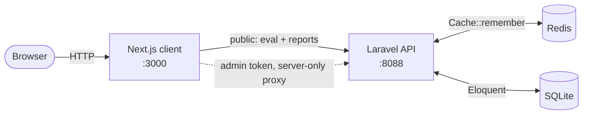
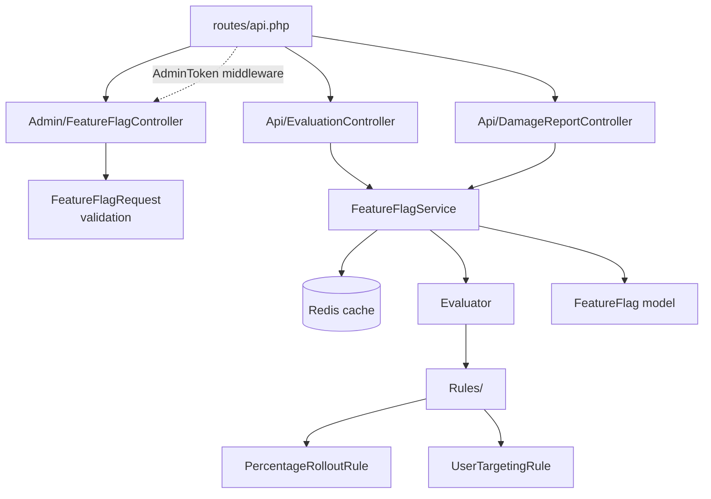
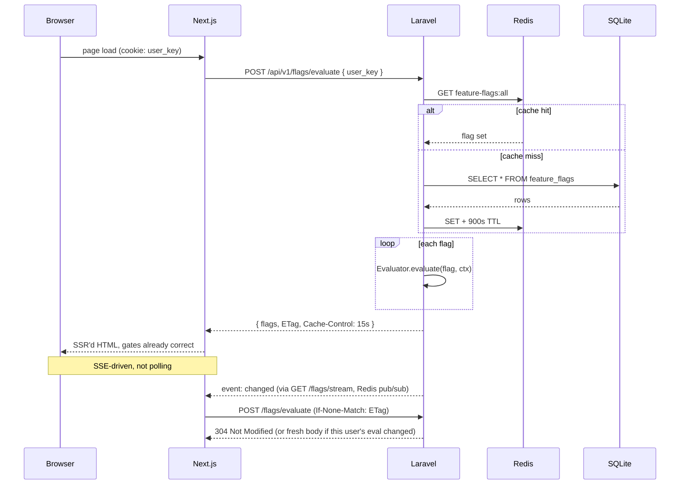
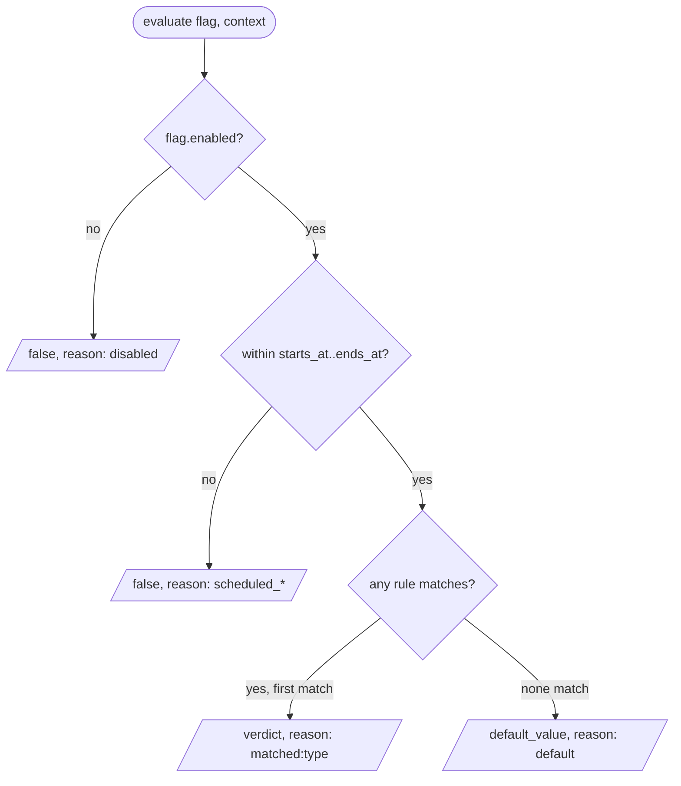
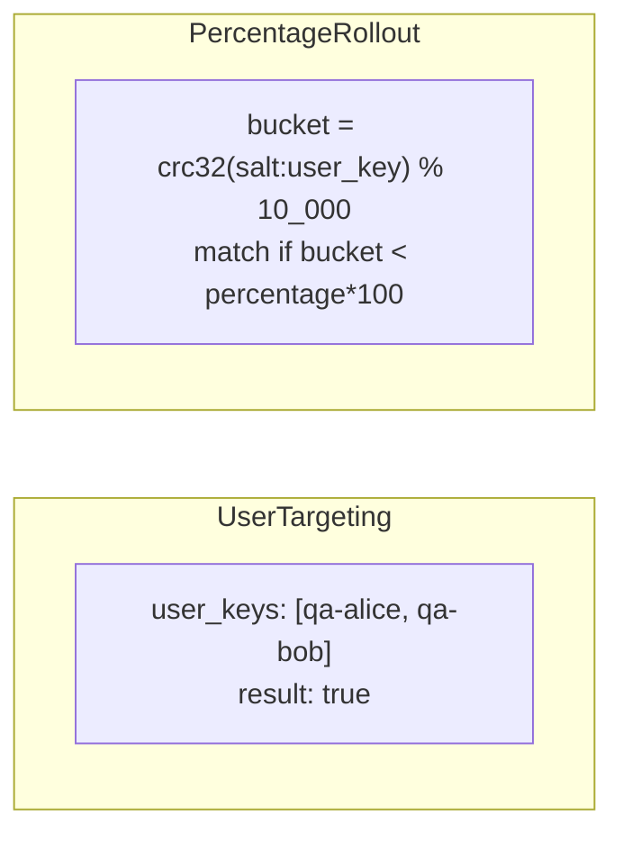
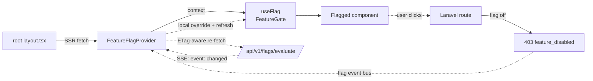
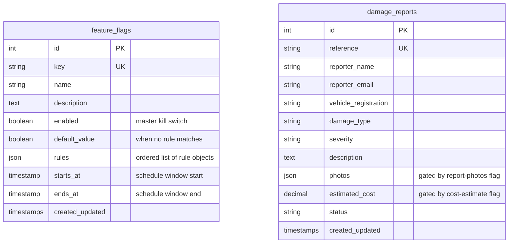
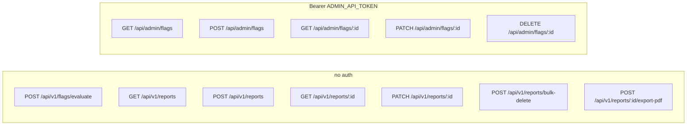

# Architecture at a glance

Open this file in a Mermaid-aware viewer (VS Code preview, GitHub, Cursor).

---

## 1. The whole system

- [`api/`](api) — Laravel 11. Owns flags + reports.
- [`client/`](client) — Next.js 14 (App Router).
- Redis caches the whole flag set behind **one** key.
- SQLite is the system of record.

---

## 2. Backend layout

| Layer | File |
|---|---|
| HTTP | [`Admin/FeatureFlagController`](api/app/Http/Controllers/Admin/FeatureFlagController.php), [`Api/EvaluationController`](api/app/Http/Controllers/Api/EvaluationController.php), [`Api/DamageReportController`](api/app/Http/Controllers/Api/DamageReportController.php) |
| Auth | [`AdminToken`](api/app/Http/Middleware/AdminToken.php) middleware (bearer token) |
| Validation | [`FeatureFlagRequest`](api/app/Http/Requests/FeatureFlagRequest.php) (handles create + update) |
| Service | [`FeatureFlagService`](api/app/Services/FeatureFlags/FeatureFlagService.php) — cache + evaluator facade |
| Engine | [`Evaluator`](api/app/Services/FeatureFlags/Evaluator.php) — pure: `(flag, context) → result` |
| Rules | [`Rule`](api/app/Services/FeatureFlags/Rules/Rule.php), [`RuleFactory`](api/app/Services/FeatureFlags/Rules/RuleFactory.php), [`PercentageRolloutRule`](api/app/Services/FeatureFlags/Rules/PercentageRolloutRule.php), [`UserTargetingRule`](api/app/Services/FeatureFlags/Rules/UserTargetingRule.php) |
| Models | [`FeatureFlag`](api/app/Models/FeatureFlag.php), [`DamageReport`](api/app/Models/DamageReport.php) |

---

## 3. The hot path — flag evaluation

---

## 4. Inside the evaluator

The two rule types:

- [`UserTargetingRule`](api/app/Services/FeatureFlags/Rules/UserTargetingRule.php) — allow-list match
- [`PercentageRolloutRule`](api/app/Services/FeatureFlags/Rules/PercentageRolloutRule.php) — stable hash bucket (same user → same bucket forever)

---

## 5. How the Next.js client uses flags

Three layers of defence when a flag flips off mid-session:

1. **UI** — gate disappears within one RTT of the admin write (SSE push)
2. **Server** — re-evaluates per request, returns `403 feature_disabled`
3. **Client** — `apiFetch` catches the 403, flips local override **now**, kicks a refresh

Worst case = one wasted click.

---

## 6. Database schema

The two tables are **independent**. Flags don't reference reports; reports don't reference flags. The controller evaluates flags per request and either silently drops fields (photos, cost) or 403s the action (bulk-delete, export-pdf).

---

## 7. API surface

---

## 8. The six demo flags

| Key | Type | Demonstrates |
|---|---|---|
| `report-photos` | boolean | Silent server-side drop when off |
| `cost-estimate` | boolean | Silent server-side drop when off |
| `ai-damage-analysis` | **user_targeting + percentage_rollout** | QA cohort always-on, everyone else in 35% rollout |
| `bulk-actions` | boolean | 403 server gate on action |
| `export-pdf` | boolean | 403 server gate on action |
| `maintenance-banner` | boolean, scheduled | Demonstrates `starts_at`/`ends_at` |
